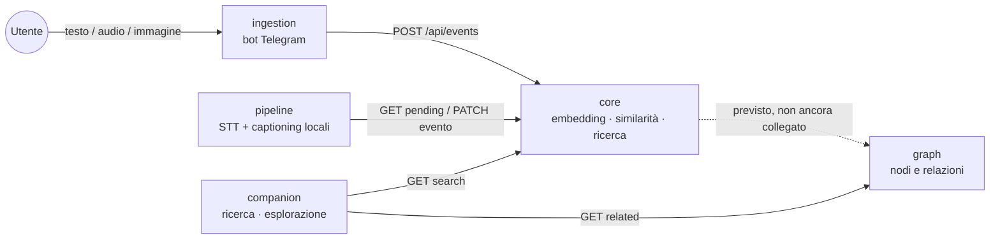

# Second Brain

Sistema personale di cattura, indicizzazione e ricerca di appunti/eventi, containerizzato su un
nodo ZimaBlade (Intel Celeron quad-core x86, 16GB RAM).

## Come funziona

Mandi un pensiero (testo, vocale o foto) a un bot Telegram. Il sistema lo trascrive/descrive se
serve, lo confronta con tutto quello che hai già salvato in passato per **significato** (non
parole chiave) e ti segnala i collegamenti rilevanti. Tutto gira in locale sul tuo nodo: embedding,
trascrizione audio e descrizione immagini usano modelli scaricati una volta e mai più inviati a
servizi esterni (Principio IV della [constitution](.specify/memory/constitution.md)).



Nota onesta sullo stato attuale: `graph` esiste, è testato ed espone già le sue API, ma `core` non
scrive ancora automaticamente nodi/relazioni a partire dagli eventi salvati (rimandato a una
feature futura, vedi [`docs/relazione-progetto.md`](docs/relazione-progetto.md) §6) — la linea
tratteggiata nel diagramma. `companion` può comunque esplorare un grafo popolato manualmente
tramite le API di `graph`.

## Esempio d'uso

Segue il contratto reale in [`API_CONTRACT.md`](API_CONTRACT.md).

1. Mandi un vocale al bot: *"Ricordami di controllare il datasheet del PCA9685 per il progetto
   Kinect"*. `ingestion` lo inoltra a `core`:

   ```bash
   curl -X POST http://core:8000/api/events \
     -H "Authorization: Bearer $CORE_API_TOKEN" -H "Content-Type: application/json" \
     -d '{"source":"telegram","user_id":"tg_123456","type":"audio","content":null,
          "media_url":"https://api.telegram.org/file/...","timestamp":"2026-08-28T10:32:00Z"}'
   # → 201 {"event_id":"evt_9f2a","status":"received"}
   ```

2. `pipeline` trova l'evento tra quelli in attesa, lo trascrive in locale con `faster-whisper` e
   aggiorna `core`:

   ```bash
   curl -X PATCH http://core:8000/api/events/evt_9f2a \
     -H "Authorization: Bearer $CORE_API_TOKEN" -H "Content-Type: application/json" \
     -d '{"normalized_text":"Ricordami di controllare il datasheet del PCA9685 per il progetto Kinect",
          "pipeline_meta":{"model_used":"stt-local","confidence":0.94}}'
   ```

3. `core` genera l'embedding in locale (`sentence-transformers`), lo confronta con tutto quello
   già salvato e, se trova un appunto simile (es. una nota precedente sul PCA9685), lo segnala
   secondo le preferenze dell'utente.

4. Giorni dopo apri `companion` dal browser e cerchi `PCA9685`:

   ```
   GET http://companion:8002/search?q=PCA9685
   ```

   → trovi entrambi gli appunti, ordinati per somiglianza di significato — anche se non
   condividono le stesse parole.

## Moduli

| Modulo | Responsabilità |
|---|---|
| [`ingestion`](ingestion/README.md) | Bot Telegram: riceve messaggi e li normalizza in eventi |
| [`pipeline`](pipeline/README.md) | Trascrizione audio e captioning immagini (modelli locali) |
| [`core`](core/README.md) | Embedding (locale), ricerca per similarità, motore decisionale |
| [`graph`](graph/README.md) | Grafo dei progetti/eventi collegati |
| [`companion`](companion/README.md) | App di consultazione (ricerca, esplorazione grafo) |

## Tecnologie

| Livello | Scelta | Perché |
|---|---|---|
| Linguaggio | Python 3.12 | uniforme su tutti e 5 i moduli |
| API | FastAPI + uvicorn (`core`, `graph`, `companion`) | async nativo, validazione via Pydantic |
| Bot | `python-telegram-bot` (long polling) | nessun webhook pubblico da esporre |
| Storage | SQLite, nessun ORM | volume da uso personale, non lo giustifica |
| Ricerca semantica | `sentence-transformers` (`paraphrase-multilingual-MiniLM-L12-v2`) + cosine similarity via `numpy` | locale, niente vector DB dedicato |
| Trascrizione audio | `faster-whisper` (modello `base`, int8, CPU) | CPU-compatibile, nessuna GPU sul nodo |
| Captioning immagini | `transformers` + BLIP (`Salesforce/blip-image-captioning-base`) | idem, CPU-only |
| Frontend | Jinja2 server-rendered (`companion`) | nessuna build JS da mantenere |
| Test | `pytest`, 117 test totali su 5 moduli | modelli/servizi esterni sempre mockati |
| Deploy | Docker + `docker-compose.yml` di root | un `Dockerfile` per modulo, build/avvio indipendenti |
| Dev tooling | [`uv`](https://astral.sh/uv) (opzionale) | condivide su disco i pacchetti identici tra le venv dei moduli |

## Possibili applicazioni

- **Secondo cervello personale**: appunti sparsi nel tempo (idee, letture, cose da controllare)
  che si ricollegano da soli per significato, senza taggare o organizzare a mano.
- **Diario vocale ricercabile**: registri un pensiero a voce mentre cammini, lo ritrovi mesi dopo
  cercando un concetto, non la frase esatta.
- **Raccolta idee/progetti**: capire quando un'idea nuova è in realtà la continuazione di una
  vecchia già abbandonata.
- **Note da riunioni/letture**: audio o foto di appunti a mano trascritti automaticamente e resi
  ricercabili insieme al resto.
- **Base di partenza per un knowledge graph personale**: `graph` e il suo `API_CONTRACT.md` sono
  già pronti per collegare eventi a progetti/persone/concetti quando servirà.

## Documentazione

Contratto tra moduli: [`API_CONTRACT.md`](API_CONTRACT.md). Stato del progetto:
[`CHANGELOG.md`](CHANGELOG.md). Deploy containerizzato: [`DEPLOY.md`](DEPLOY.md). Relazione
completa: [`docs/relazione-progetto.md`](docs/relazione-progetto.md). Problemi noti e come sono
stati risolti: [`docs/knowledge-base/`](docs/knowledge-base/).

## Principi

- Privacy-first: nessuno storage non necessario di dati sensibili.
- Ogni modulo espone un'API chiara, testabile in isolamento.
- Preferenza per modelli locali leggeri (embedding, STT, captioning) rispetto a servizi esterni, su nodo ZimaBlade.

## Branching

- `main` protetto, merge solo via PR.
- Feature branch: `feature/<modulo>-<descrizione>`.
